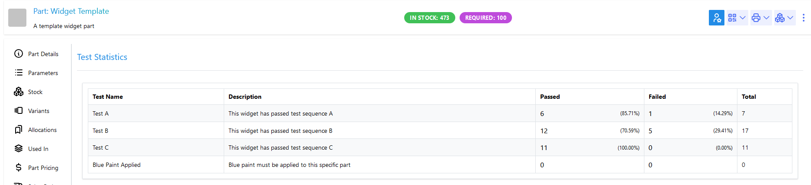
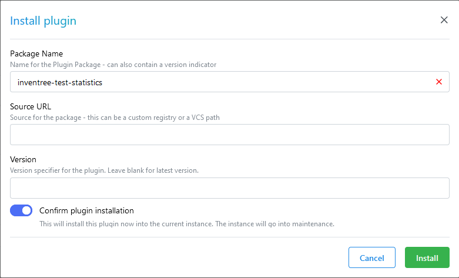

[](https://opensource.org/licenses/MIT)
[](https://pypi.org/project/inventree-test-statistics/)


# InvenTree Test Statistics Plugin

An [InvenTree](https://inventree.org) plugin for generating and viewing statistical test data.

## Description

The *Test Statistics* plugin provides a panel for viewing statistical test data aggregated by test template. It displays pass/fail counts and percentages, supports date range filtering, and shows month-by-month breakdowns as bar charts.

Test statistics can be generated for a particular part, or for a selected build order.

| Context | Screenshot |
| --- | --- |
| Test for a part (including variants) |  |

## Features

### Panel Interface

The statistics panel provides:

- **Date range selector** — Filter results by month using start and end date pickers. Defaults to the past year.
- **Include Variants toggle** — Optionally include test results from variant parts in the statistics.
- **Results table** — Each row represents a single (enabled) test template and shows:
  - Test name and description
  - Total pass and fail counts, each with percentage of total runs
  - Total number of test executions
- **Monthly breakdown** — Click to expand any row and view a stacked bar chart of pass/fail counts broken down month by month across the selected date range.

### API

The plugin exposes a REST endpoint at `plugin/test_statistics/statistics/` that accepts the following query parameters:

| Parameter | Type | Description |
|---|---|---|
| `part` | integer | Filter by Part (primary key) |
| `include_variants` | boolean | Include variant parts in results (default: `false`) |
| `build` | integer | Filter by Build Order (primary key) |
| `stock_item` | integer | Filter by Stock Item (primary key) |
| `date_after` | date | Include results on or after this date |
| `date_before` | date | Include results on or before this date |
| `started_after` | datetime | Include results where test started on or after this datetime |
| `started_before` | datetime | Include results where test started on or before this datetime |
| `finished_after` | datetime | Include results where test finished on or after this datetime |
| `finished_before` | datetime | Include results where test finished on or before this datetime |

Only test templates with `enabled=True` are included in the response.

#### Response Format

The endpoint returns a list of objects, one per test template:

```json
[
  {
    "template": 1,
    "template_detail": {
      "test_name": "Voltage Test",
      "description": "..."
    },
    "pass_count": 42,
    "fail_count": 3,
    "monthly": [
      { "month": "2024-01-01", "pass_count": 10, "fail_count": 1 },
      { "month": "2024-02-01", "pass_count": 32, "fail_count": 2 }
    ]
  }
]
```

## Installation

### Via User Interface

The simplest way to install this plugin is from the InvenTree plugin interface. Enter the plugin name (`inventree-test-statistics`) and click the `Install` button:



### Via Pip

Alternatively, the plugin can be installed manually from the command line via `pip`:

```bash
pip install -U inventree-test-statistics
```

*Note: After the plugin is installed, it must be activated via the InvenTree plugin interface.*

## Contributing

### Backend

Backend code is written in Python, and is located in the `test_statistics` directory.

### Frontend

Frontend code is written in TypeScript, and is located in the `frontend` directory. Read the [frontend README](frontend/README.md) for more information.
